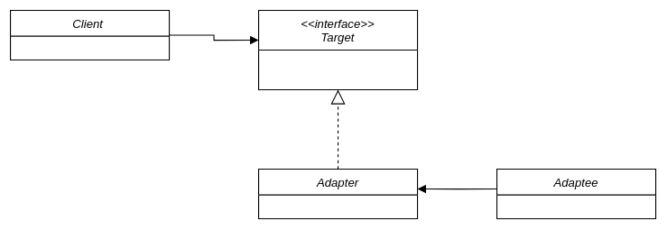

# The Adapter Pattern 

**Converts the interface of a class into anotoher interface** the clients expect. Adapter lets classes work together that couldn't otherwise because of incompatible inteface.

## Adapting Turkey to Duck

    

