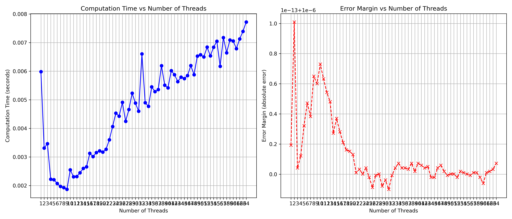

# Calculation of Pi Using Multithreading: Final Report

## Cover Page

- **Title:** Efficient Calculation of Pi via Multithreading
- **Author:** Mustafa Arinmis 
- **Course:** Parallel Computing 

---

## Introduction

The purpose of this project was to calculate the value of Pi (π) using a multithreaded approach to perform 1,000,000 addition and subtraction operations based on the Taylor series expansion. This method is significant for demonstrating the advantages of parallel computing in reducing computation time for large-scale mathematical operations.

## Problem Statement & Solution Strategy

### Problem Statement

The computation of Pi (π) using the Taylor series involves a large number of repetitive addition and subtraction operations. Performing these operations sequentially can be time-consuming and inefficient, especially as the number of required operations increases.

### Solution Strategy

Our solution utilizes a multithreaded programming approach to distribute the computational workload across multiple processing threads. This strategy aims to leverage the multi-core architecture of modern CPUs, reducing overall computation time by executing multiple operations in parallel.

## Data Visualizations for the Results

The following figure presents the results of our computations, showing the relationship between the number of threads used and the computation time for calculating Pi with 500,000 add/sub operations.

## Analysis of Results

### Approximation Error and Duration of the Computation

The analysis of the computation duration and approximation error reveals a significant decrease in computation time with an increase in the number of threads, up to a certain point. Beyond this point, the overhead of managing additional threads outweighs the benefits, leading to a plateau in performance improvements.

### Conclusion

The multithreaded approach to calculating Pi demonstrates a clear advantage in terms of reducing computation time, validating the efficacy of parallel computing for mathematical operations. However, the marginal gains diminish as the number of threads exceeds the optimal threshold, indicating a limit to the scalability of this method due to overhead costs.

